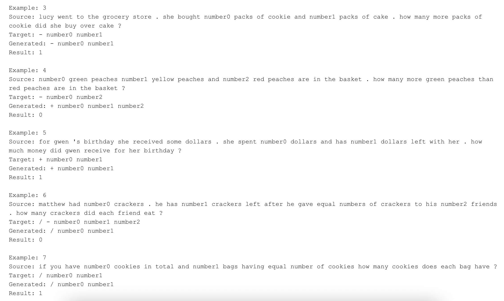

# BERT-Based Hybrid Transformer for Math Word Problems

This repository contains the BERT-Based Hybrid Transformer model, designed to classify mathematical word problems into their corresponding equations.

## Model Design

The architecture integrates a `BertEncoder` with a `BertModel`, featuring 30,522 word embeddings and 512 position embeddings, each of size 768. It comprises 12 BertLayers with attention mechanisms and linear layers. Additionally, a Transformer with 4 encoder and 4 decoder layers equipped with multihead attention and linear transformations is included. Positional encoding and dropout are used for improved sequence understanding and regularization. A classification head is added to predict mathematical equations.

### Model Architecture

Here's an overview of our model architecture:
BERT-Based Hybrid Transformer Architecture
------------------------------------------

BERT-Based Hybrid Transformer Architecture
------------------------------------------

BertEncoder \
├── BertModel \
│   ├── Embeddings (Word, Position, Token Type) \
│   ├── Encoder \
│   │   └── 12 x BertLayer \
│   │       └── Attention \
│   ├── Intermediate \
│   ├── Output \
│   └── Pooler \
└── PositionalEncoding (for secondary positional encoding, if any) \
└── Embedding (for secondary embeddings, if any) \
Transformer \
├── Encoder \
│   └── 4 x EncoderLayer \
│       ├── Self Attention \
│       ├── Dense \
│       ├── Norm \
│       └── Dropout \
└── Decoder \
    └── 4 x DecoderLayer \
        ├── Self Attention \
        ├── Multihead Attention \
        ├── Dense \
        ├── Norm \
        └── Dropout \
Output Layer \
└── Linear \
    └── Loss Function \
        └── CrossEntropyLoss 

## Training and Fine-Tuning
- **Learning Rates**: BERT embeddings - 3e-5, transformer parameters - 1e-5.
- **Optimization**: 15 epochs of fine-tuning on a GPU setup.

## Comparative Analysis
- **Benchmarking**: Comparable to state-of-the-art results, demonstrating the viability of BERT for math equation prediction.
- **Innovation**: Application of pretrained bidirectional language representations for equation prediction.

## Model and Results

The model and results are stored in the following Google Drive folder:
[Google Drive Folder](https://drive.google.com/drive/folders/11vwpchF_H6439FfMevTRKS7JZGfyAnMa?usp=sharing)

### Model Accuracy Details

- Best Epoch: 10
- Train Loss (Epoch): 0.1649
- Minimum Train Loss: 0.1649
- Validation Loss (Epoch): 1.3862
- Minimum Validation Loss: 1.0868
- Training Accuracy (Epoch): 60.92%
- Maximum Training Accuracy: 62.36%
- Validation Accuracy (Epoch): 40.21%
- Maximum Validation Accuracy: 40.21%

## Sample Outputs

Below are some sample outputs from our model:

